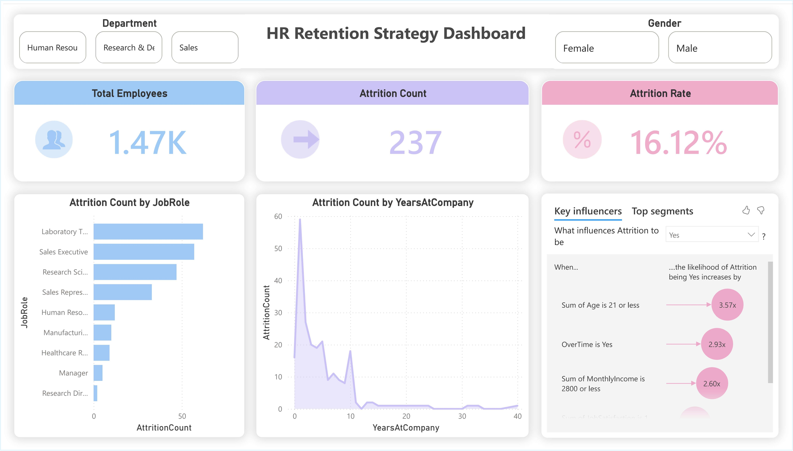

# 📊 Employee Retention Strategy Dashboard

## 🚀 Executive Summary
This Business Intelligence project addresses a critical HR challenge: **Workforce Attrition**. By analyzing employee data, this dashboard transforms raw metrics into actionable **Retention Strategies**, moving beyond simple reporting to **predictive root cause analysis**.

It identifies *why* employees leave and highlights specific high-risk segments (e.g., Laboratory Technicians), enabling stakeholders to target interventions and reduce hiring costs.

## 📸 Dashboard Preview

*(Note: This is a static preview. Download the `.pbix` file to interact with the dashboard.)*

---

## 💼 Business Problem
High employee turnover leads to increased recruitment costs and operational instability. The HR department lacked visibility into the specific drivers of attrition, relying on intuition rather than data.

**Key Objectives:**
1.  **Quantify Attrition:** Measure precise attrition rates across departments.
2.  **Identify Drivers:** Use AI analytics to find the correlation between variables (e.g., Overtime, Age) and turnover.
3.  **Strategic Segmentation:** Pinpoint "High Flight Risk" roles to prioritize retention efforts.

---

## 🛠️ Solution Architecture
This project simulates a real-world Business Analyst workflow:

### 1. Data Transformation (ETL)
* **Tool:** Power Query
* **Process:** Cleaned raw HR data, normalized column types, and created conditional columns to categorize "Age Groups" and "Tenure Buckets."

### 2. Data Modeling & DAX
* **Measures:** Engineered explicit measures rather than relying on implicit aggregations to ensure accuracy.
    * `Attrition Rate = DIVIDE([Attrition Count], [Employee Count])`
    * `Active Headcount` (Dynamic Calculation based on filters)

### 3. AI-Driven Analysis
* **Key Influencers Visual:** Integrated Power BI’s AI capabilities to statistically validate that **"Overtime = Yes"** and **"Age < 25"** are the primary predictors of attrition.

---

## 💡 Strategic Insights & Recommendations
Based on the data analysis, the following actionable insights were uncovered:

* **⚠️ The Onboarding Gap:** Attrition spikes significantly within the first **12 months** of employment.
    * *Recommendation:* Revamp the onboarding process and implement 30-60-90 day check-ins.
* **🚨 High-Risk Roles:** **Laboratory Technicians** showed the highest turnover rate compared to other roles.
    * *Recommendation:* Review compensation benchmarks and workload balance for this specific job role.
* **📉 The Overtime Factor:** Employees working overtime are **2.9x more likely** to quit.
    * *Recommendation:* Audit resource allocation to reduce burnout.

---

## 💻 Tools Used
* **Microsoft Power BI** (Visualization & Modeling)
* **DAX** (Data Analysis Expressions)
* **Power Query** (ETL)
* **AI Analytics** (Key Influencers & Decomposition Trees)

## 📥 How to View
1.  Download the `HR_Retention_Strategy.pbix` file from this repository.
2.  Open it in **Microsoft Power BI Desktop**.
3.  Interact with the slicers (Department, Gender) to see how the "Key Influencers" and KPIs update dynamically.
